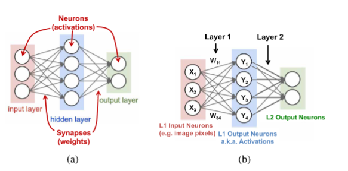
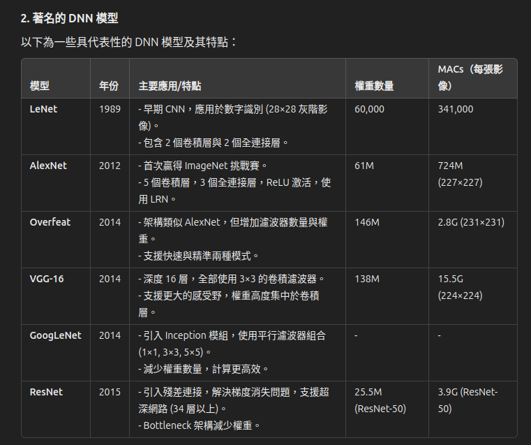
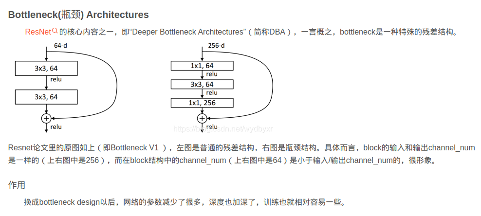

# Efficient Processing of Deep Neural Networks: A Tutorial and Survey 的閱讀

## 前言

```txt
Deep neural networks (DNNs) are currently widely used for many artificial intelligence (AI) applications including computer vision, speech recognition, and robotics. While DNNs deliver state-of-the-art accuracy on many AI tasks, it comes at the cost of high computational complexity. Accordingly, techniques that enable efficient processing of DNNs to improve energy efficiency and throughput without sacrificing application accuracy or increasing hardware cost are critical to the wide deployment of DNNs in AI systems

深度神經網絡（DNN）目前廣泛應用於許多人工智慧（AI）應用，包括計算機視覺、語音識別和機器人技術。雖然DNN在許多AI任務上提供了最先進的準確性，但這是以高計算複雜性為代價的。因此，實現DNN高效處理的技術對於提高能源效率和吞吐量而不犧牲應用準確性或增加硬件成本至關重要，這對於DNN在AI系統中的廣泛部署至關重要。

This article aims to provide a comprehensive tutorial and survey about the recent advances toward the goal of enabling efficient processing of DNNs. Specifically, it will provide an overview of DNNs, discuss various hardware platforms and architectures that support DNNs, and highlight key trends in reducing the computation cost of DNNs either solely via hardware design changes or via joint hardware design and DNN algorithm changes. It will also summarize various development resources that enable researchers and 
practitioners to quickly get started in this field, and highlight important benchmarking metrics and design considerations that should be used for evaluating the rapidly growing number 
of DNN hardware designs, optionally including algorithmic codesigns, being proposed in academia and industry. The reader will take away the following concepts from this article: 
understand the key design considerations for DNNs; be able to evaluate different DNN hardware implementations with benchmarks and comparison metrics; understand the tradeoffs 
between various hardware architectures and platforms; be able to evaluate the utility of various DNN design techniques for efficient processing; and understand recent implementation trends and opportunities.

這篇文章旨在提供關於實現高效深度神經網絡（DNN）處理的最新進展的綜合教程和調查。具體來說，它將概述DNN，討論支持DNN的各種硬件平台和架構，並重點介紹通過硬件設計變更或硬件設計與DNN算法變更相結合來降低DNN計算成本的關鍵趨勢。它還將總結各種開發資源，使研究人員和從業者能夠快速入門這一領域，並強調應用於評估學術界和工業界提出的快速增長的DNN硬件設計（可選包括算法協同設計）的重要基準測試指標和設計考慮因素。讀者將從這篇文章中了解以下概念：

- 理解深度神經網絡（DNN）的關鍵設計考慮因素；

- 能夠使用基準測試和比較指標評估不同的DNN硬件實現；

- 理解不同硬件架構和平台之間的權衡；

- 能夠評估各種DNN設計技術的實用性，以實現高效處理；

- 了解最近的實施趨勢和機會。

KEYWORDS
ASIC; 應用專用集成電路
computer architecture; 計算機架構
convolutional neural networks; 卷積神經網絡
dataflow processing; 數據流處理
deep learning; 深度學習
deep neural networks; 深度神經網絡
energy-efficient accelerators; 能效加速器
low power; 低功耗
machine learning; 機器學習
spatial architectures; 空間架構
VLSI; 超大規模集成電路
```

## 第一節

```txt
Deep neural networks (DNNs) are currently the foundation for many modern artificial intelligence (AI) applications [1]. Since the breakthrough application of DNNs to speech recognition [2] and image recognition [3], the number of applications that use DNNs has exploded. These DNNs are employed in a myriad of applications from selfdriving cars [4], to detecting cancer [5] to playing complex games [6]. In many of these domains, DNNs are now able to exceed human accuracy. The superior performance of DNNs comes from its ability to extract high-level features from raw sensory data after using statistical learning over a large amount of data to obtain an effective representation of an input space. This is different from earlier approaches that use hand-crafted features or rules designed by experts. The superior accuracy of DNNs, however, comes at the cost of high computational complexity. While general-purpose compute engines, especially graphics processing units (GPUs), have been the mainstay for much DNN processing, increasingly there is interest in providing more specialized acceleration of the DNN computation. This article aims to provide an overview of DNNs, the various tools for understanding their behavior, and the techniques being explored to efficiently accelerate their computation.

深度神經網絡（DNN）目前是許多現代人工智慧（AI）應用的基礎[1]。自從DNN在語音識別[2]和圖像識別[3]方面取得突破性應用以來，使用DNN的應用數量激增。這些DNN被應用於從自駕車[4]、癌症檢測[5]到玩複雜遊戲[6]的各種應用中。在許多這些領域，DNN現在能夠超越人類的準確性。DNN的卓越性能來自於其能夠從原始感官數據中提取高級特徵，並通過對大量數據進行統計學習來獲得有效的輸入空間表示。這與早期使用專家設計的手工特徵或規則的方法不同。
然而，DNN的卓越準確性是以高計算複雜性為代價的。雖然通用計算引擎，特別是圖形處理單元（GPU），一直是許多DNN處理的主力，但越來越多的人對提供更專門的DNN計算加速感興趣。這篇文章旨在概述DNN、理解其行為的各種工具以及探索高效加速其計算的技術。

This paper is organized as follows.
•  Section II provides background on the context of why
DNNs are important, their history and applications.
•  Section III gives an overview of the basic components
of DNNs and popular DNN models currently in use.
•  Section IV describes the various resources used for
DNN research and development.
•  Section V describes the various hardware platform
used to process DNNs and the various optimizations 
used to improve throughput and energy efficiency 
without impacting application accuracy (i.e., produce 
bitwise identical results).
•  Section VI discusses how mixed-signal circuits and new
memory technologies can be used for near-data processing to address the expensive data movement that dominates throughput and energy consumption of DNNs.
•  Section VII describes various joint algorithm and hardware optimizations that can be performed on DNNs t
improve both throughput and energy efficiency while 
trying to minimize impact on accuracy.
•  Section VIII describes the key metrics that should be
considered when comparing various DNN designs.

這篇文章的組織如下：

- 第二節 提供了為什麼深度神經網絡（DNN）重要的背景、歷史和應用。

- 第三節 概述了DNN的基本組成部分和目前使用的流行DNN模型。

- 第四節 描述了用於DNN研究和開發的各種資源。

- 第五節 描述了用於處理DNN的各種硬件平台和各種優化技術，以在不影響應用準確性的情況下提高吞吐量和能源效率（即產生位元相同的結果）。

- 第六節 討論了如何使用混合信號電路和新型存儲技術進行近數據處理，以解決主導DNN吞吐量和能耗的昂貴數據移動問題。

- 第七節 描述了可以在DNN上執行的各種聯合算法和硬件優化，以在盡量減少對準確性影響的情況下提高吞吐量和能源效率。

- 第八節 描述了在比較各種DNN設計時應考慮的關鍵指標。
```

## 第二節 介紹 DNN 的背景

A. AI 跟 深度神經網絡(DNNs)

```txt
就是科學家先嘗試用人類的大腦當作機器學習的參考來源

把我們的大腦的運作概念拿出來 我們的大腦主要工作原理如下

大腦的主要計算單元是神經元（neuron）。在一個平均人類大腦中，約有 860 億個神經元。神經元彼此通過樹突（dendrites）和軸突（axon）相連，前者為輸入元素，後者為輸出元素，如圖 2 所示。神經元通過樹突接收輸入信號，對這些信號進行計算，並在軸突上生成輸出信號。這些輸入和輸出信號被稱為激活（activations）。一個神經元的軸突分支與許多其他神經元的樹突相連。軸突分支與樹突之間的連接被稱為突觸（synapse）。

延伸下來到機器學習上

突觸的一個關鍵特性是它能夠對穿過它的信號（𝑥𝑖）進行縮放。這個縮放因子被稱為權重（𝑤𝑖​）。
據推測，大腦的學習方式是通過調整與突觸相關的權重實現的。因此，不同的權重會對相同的輸入產生不同的反應。需要注意的是，學習是指權重因學習刺激而進行的調整，而大腦的組織結構（可以視為類似於程序的部分）並不改變。這一特性使大腦成為機器學習風格算法的極佳靈感來源。

在受大腦啟發的計算範疇內，有一個子領域稱為「脈衝計算」（spiking computing）。該領域的靈感來自於這樣的事實：在樹突和軸突之間的通信是脈衝形式的信號，且信息的傳遞並不僅僅取決於脈衝的幅度，而是與脈衝到達的時間有關。神經元中的計算並不僅依賴於單一值，而是依賴於脈衝的寬度及不同脈衝之間的時間關係。一個受脈衝大腦特性啟發的典型項目是 IBM 的 TrueNorth。

與脈衝計算相對，另一個受大腦啟發的計算子領域是「神經網絡」（neural networks），而這正是本文的重點所在。
```

B. 神經網絡與深度神經網絡 (DNNs)

```txt
神經網絡的靈感來自於這樣的概念：神經元的計算涉及輸入值的加權和。這些加權和對應於突觸進行的信號縮放以及神經元內部對這些值的結合。此外，神經元的輸出不僅僅是加權和，因為如果僅是這樣，則一系列神經元的計算將僅僅是簡單的線性代數操作。相反，在神經元內部存在一個對組合輸入進行運算的功能操作。

這種操作通常被認為是一個非線性函數，它使得神經元只有在輸入值超過某個閾值時才會生成輸出。因此，通過類比，神經網絡對輸入值的加權和應用了一個非線性函數。在第 III-A1 節中，我們將探討這些非線性函數的具體形式。



圖a 輸入層的神經元接收一些值，並將這些值傳遞到網絡的中間層神經元，該中間層也經常被稱為「隱藏層」。來自一個或多個隱藏層的加權和最終會傳遞到輸出層，輸出層向用戶呈現網絡的最終輸出。 神經元的輸出通常被稱為激活（activations），而突觸則通常被稱為權重（weights）跟大腦的運作一樣

圖b 神經網絡的領域中，有一個稱為深度學習的分支，其特點是神經網絡包含多於三層的結構，即超過一個隱藏層。
```

C. 推理與訓練

```txt
由於深度神經網絡 (DNNs) 是機器學習算法的一種實例，其基本程序在學習執行指定任務的過程中並不會改變。對於 DNNs 而言，這種學習過程涉及確定網絡中的權重（和偏置）的值，這被稱為「訓練網絡」。

一旦訓練完成，程序就可以使用在訓練過程中確定的權重來計算網絡的輸出並執行其任務。使用這些權重運行程序的過程被稱為「推理」（inference）。

本文將重點放在 DNN 推理的高效處理上，而非訓練，因為 DNN 推理通常是在嵌入式設備（而非雲端）上執行，這些設備的資源有限。
```

推理與訓練的區別

1.推理

- 已訓練好的 DNN 使用固定的權重和偏置進行計算，來執行特定任務，例如圖像分類。
- 推理的目的是根據輸入資料產生輸出結果，通常應用於資源有限的設備（如嵌入式設備）。
- 精度需求較低，可採用一些降低精度的技術以提高效率。

2.訓練

- 目的是透過調整權重與偏置，使網絡的輸出更接近目標結果，最小化損失函數 𝐿。
- 利用優化方法（如梯度下降）來逐步更新權重。
- 訓練過程需要大量計算資源與較高的數值精度，並且需要存儲中間輸出以進行反向傳播（Backpropagation）。

訓練的技巧與類型

1.訓練技術

- 使用「批量」損失更新權重：累積多組數據後一次更新，可加速和穩定訓練過程。
- 反向傳播：通過鏈式法則計算每個權重對損失的偏導數，進行高效梯度計算。

2.學習類型

- 監督學習：使用帶有標籤的數據進行訓練（最常見）。
- 無監督學習：用未標籤數據找出結構或群集。
- 半監督學習：結合少量標籤數據和大量未標籤數據。
- 強化學習：基於環境反饋進行動作選擇，目標是最大化長期回報。

3.微調（Fine-Tuning）

- 使用先前訓練好的模型權重作為起點，再針對新數據或約束條件進行調整。
- 優點：加快訓練速度，並可能提升準確性（如遷移學習）。

4.訓練與推理的資源需求差異

- 訓練 需要更多計算資源與存儲，因為必須保存中間結果並進行精確的梯度計算。
- 推理 資源需求較低，特別是在應用於嵌入式設備時，可以採用降低精度的技術以提高運算效率。

D. 深度學習成功的三大因素

1.大量的訓練數據

- 強大的表示學習需要大量數據支持。
- 例子：
  - Facebook 每日接收 10 億張圖片。
  -Walmart 每小時創建 2.5 PB 的客戶數據。
  -YouTube 每分鐘上傳 300 小時影片。
- 巨量數據成為訓練演算法的基石。

2.強大的計算能力

- 半導體技術與計算架構的進步提升了運算效能。
- DNN 中的大量加權求和運算如今能在合理時間內完成，成為訓練與推理的基礎。

3.演算法與工具的進化

- DNN 的成功激發了更多演算法的發展。
- 開源框架（如 TensorFlow、PyTorch 等）的發展使研究者更容易探索與應用 DNN。
- 新技術不僅提升了應用的準確性，也擴展了 DNN 的適用範圍。

E. Development History

介紹 DNN 的應用

1.影像與影片分析

- 影片的數據規模
  - 影片佔據當今互聯網流量的 70% 以上。
  - 每天全球收集超過 8 億小時的監控影片。
- DNN 在影像與影片領域的應用
  - 電腦視覺：DNN 提升了多項電腦視覺任務的準確性，例如：
  - 影像分類
  - 利用 DNN 分類影像中的物體。
- 物體定位與檢測
  - 確定影像中物體的位置並標註。
- 影像分割
  - 將影像劃分為不同區域，用於區域性分析。
- 行為識別
  - 辨識影片中人物的動作和行為模式。

2.語音與語言處理

- 語音識別
  - 顯著提高了語音辨識的準確性。
- 機器翻譯
  - 支援語言之間的高效轉換。
- 自然語言處理 (NLP)
  - 用於情感分析、語義理解等任務。
- 音頻生成
  - 生成高品質的音樂或語音。

3.醫療領域

- 基因組學
  - 幫助研究自閉症、癌症和脊髓性肌萎縮症等疾病的遺傳基因。
  - 醫學影像分析
- 用於檢測多種癌症：
  - 皮膚癌
  - 腦癌
  - 乳腺癌

4.遊戲領域

- 經典遊戲
  - 在 Atari 遊戲 中表現超越人類。
- 圍棋
  - 通過 AlphaGo 打破了人類在圍棋上的優勢，解決了無法全面搜索可能性的挑戰。
- 強化學習
  - 融合創新的訓練技術，推動了遊戲 AI 的進步。

5.機器人技術

- 機械臂抓取
  - 增強了機器人執行精細操作的能力。
- 地面機器人規劃
  - 幫助地面機器人實現運動規劃。
- 視覺導航
  - 提升機器人的自主視覺導引能力。
- 無人機穩定控制
  - 控制四軸飛行器的穩定性。
- 自動駕駛策略
  - 用於自動駕駛車輛的路徑規劃與決策。

F. Embedded Versus Cloud

是在對比雲端和嵌入式平台在深度學習應用中的角色和優劣勢

- 嵌入式（Embedded）
指的是將 DNN 推理處理放在靠近感測器或邊緣設備（如 IoT 設備、手機、自駕車等）上執行，目的是降低延遲、減少依賴雲端連線、增強隱私與安全性。這類設備通常具有資源限制（如有限的電力、計算能力和記憶體），因此需要高效的計算方法。

- 雲端（Cloud）
指的是將深度學習的計算任務放在大型數據中心中執行，特別是訓練任務。雲端具有強大的計算資源和儲存能力，非常適合處理龐大的數據集和多次迭代的計算。

這段討論的重點在於：

哪些場合更適合雲端，哪些場合更適合嵌入式。
推理與訓練的需求差異（如延遲、資源限制和隱私）。
針對嵌入式平台的挑戰和需求，例如在有限資源下如何進行高效的 DNN 推理。

嵌入式平台的挑戰 - 執行 DNN 推理的嵌入式平台面臨以下嚴格限制：

- 能耗
- 計算資源
- 記憶體成本

因此，在這些限制下，高效的 DNN 處理變得至關重要。這篇論文專注於推理的計算需求，而非訓練的計算需求。

## 第三節 深度神經網路（DNN）的概述

有2種形式的深度神經網路：前饋型 (feedforward) 和循環型 (recurrent)

前饋型：所有的計算都是基於上一層的輸出進行序列操作。最後一組操作生成網路的輸出，例如，判定圖像中是否包含特定物件的機率，音訊序列中是否包含特定詞語的機率，或圖像中物件的邊界框，或是應該採取的建議動作。在這些 DNN 中，網路沒有記憶，輸入的輸出總是相同，無論之前給予網路的輸入序列如何。

循環型：擁有內部記憶，能夠讓長期依賴關係影響輸出。在這些網路中，一些中間操作生成的值會被網路內部存儲，並用於後續處理的其他操作。

DNNs 可以僅由全連接 (FC) 層組成，如 Fig. 8(b) 左側所示。在全連接層中，所有的輸出激活都是由所有輸入激活的加權總和組成（即所有輸出都與所有輸入連接）。這需要大量的存儲和計算。然而，在許多應用中，我們可以移除部分激活之間的連接，只需將權重設為零，而不會影響準確度。這樣便形成了稀疏連接層。在 Fig. 8(b) 右側所示為稀疏連接層。

我們也可以通過限制影響輸出的權重數量來讓計算更加高效。如果每個輸出只是一個固定大小的窗口對應的輸入函數，則會產生這種結構性稀疏性。此外，若每個輸出的計算都使用相同的一組權重，便能顯著減少權重存儲的需求。這種重複使用相同權重的方式稱為權重共享，能夠大幅減少權重的存儲需求。

一種非常流行的窗口化與權重共享的 DNN 層是將計算結構化為卷積，如 Fig. 9(a) 所示。每個輸出激活的加權總和是透過僅僅一小部分輸入激活的鄰域來計算（即，超出鄰域的所有權重設為零）；這個鄰域常稱為“接受領域”。此外，每個輸出的相同一組權重是共享的（即，濾波器是空間不變的）。這樣的卷積層稱為卷積 (CONV) 層。

A. 卷積神經網路 (CNNs) 的介紹

卷積神經網路 (CNNs) 是深度神經網路 (DNNs) 的一種常見形式，其結構由多個卷積層 (CONV layers) 組成，如圖 10 所示。

主要用於處理視覺相關的任務，例如圖像辨識、物體檢測和影像分類。CNN 神經網路模仿人類視覺系統對圖像的處理方式，能夠自動從圖像中提取出不同層次的特徵，並用於對圖像進行分類或其他任務。

CNN 神經網路的結構由多層神經元組成，每層神經元負責不同的計算，這種層次化結構使 CNN 神經網路能夠逐步從低階特徵中提取資訊，再進一步聚合成高階的抽象特徵，最終完成對整個圖像的理解。

而 CNN 神經網路的優勢在於能自動學習和提取圖像中的關鍵特徵，如形狀、紋理和顏色，而無需人工設計特徵。它通過卷積層高效處理大型圖像數據，避免傳統神經網路因參數過多而計算量過大的問題。此外，CNN 神經網路還具有強大的泛化能力（generalization），能夠在不同場景和數據上保持高準確率，實現對新圖像的準確預測。

卷積神經網路的架構通常由以下三個主要層次組成，每一層都在不同的層級上提取圖像特徵，逐步提高模型的識別能力。

卷積層（Convolution Layer）

卷積層是卷積神經網路的核心，它負責自動提取圖像的局部特徵。透過卷積運算，模型會使用稱為「卷積核」的小矩陣在輸入圖像上滑動，逐一捕捉局部範圍內的特徵，例如邊緣、角落等。卷積層能有效減少圖像的資訊量，同時保留重要的特徵，並且支援多層疊加，從淺層的低階特徵（如顏色和紋理）到深層的高階特徵（如形狀和物體輪廓），逐層加深特徵的抽象程度。

池化層（Pooling Layer）

池化層主要用於進一步縮小特徵圖的尺寸，減少計算量的同時、避免過擬合（over fitting）。最常用的是最大池化（Max Pooling），即在一個小區域內取最大值作為該區域的代表，這有助於過濾雜訊，增強模型對於平移不變性（translation invariance）的穩健性（robustness）。經過池化層，特徵圖的尺寸大幅縮減，同時保留了最重要的資訊。

全連接層（Fully Connected Layer）

全連接層位於卷積神經網路的尾端，用於將經過卷積和池化的特徵進行分類或預測。此層將所有的輸入特徵「攤平」，並將其連接到一個或多個神經元，最終輸出對應於每個分類的概率。全連接層通常配合 Softmax 函式來確定最終的分類結果。

B. 著名的 DNN 模型



DNN 結構的多樣性

- 架構差異：
  不同 DNN 模型在以下方面有所不同：
- 層數（深度）
- 層類型（卷積層、全連接層等）
- 層的形狀（如濾波器大小、通道數與濾波器數量）
- 層與層之間的連接方式

模型發展趨勢

1.增加深度：

- 更深的網路通常能提升準確性，因為它們能學習更具層次性且更具辨識力的特徵表達。

2.卷積層為主：

- 大多數計算資源與權重集中於卷積層，而全連接層的比重逐漸減少。

3.創新技術：

- Bottleneck 機制：減少權重數量，提高效率。 (ResNet )
- 殘差連接：解決梯度消失，支持更深層的網路。 (https://hackmd.io/@steven0129/Sy_PrizoB)
- 平行處理 (Inception 模組)：多尺度處理輸入，提高特徵提取能力。

## 第四節 DNN 開發資源

促進深度神經網路 (DNN) 快速發展的關鍵因素之一是研究社群與產業所提供的一系列開發資源。這些資源不僅對 DNN 的發展至關重要，還為 DNN 加速器的開發提供了支持，透過以下方式發揮作用：

1. 提供工作負載的特性描述。
2. 促進對模型複雜性與準確性之間權衡的探索。
 