# Efficient Processing of Deep Neural Networks: A Tutorial and Survey 的閱讀

## 前言

```txt
Deep neural networks (DNNs) are currently widely used for many artificial intelligence (AI) applications including computer vision, speech recognition, and robotics. While DNNs deliver state-of-the-art accuracy on many AI tasks, it comes at the cost of high computational complexity. Accordingly, techniques that enable efficient processing of DNNs to improve energy efficiency and throughput without sacrificing application accuracy or increasing hardware cost are critical to the wide deployment of DNNs in AI systems

深度神經網絡（DNN）目前廣泛應用於許多人工智慧（AI）應用，包括計算機視覺、語音識別和機器人技術。雖然DNN在許多AI任務上提供了最先進的準確性，但這是以高計算複雜性為代價的。因此，實現DNN高效處理的技術對於提高能源效率和吞吐量而不犧牲應用準確性或增加硬件成本至關重要，這對於DNN在AI系統中的廣泛部署至關重要。

This article aims to provide a comprehensive tutorial and survey about the recent advances toward the goal of enabling efficient processing of DNNs. Specifically, it will provide an overview of DNNs, discuss various hardware platforms and architectures that support DNNs, and highlight key trends in reducing the computation cost of DNNs either solely via hardware design changes or via joint hardware design and DNN algorithm changes. It will also summarize various development resources that enable researchers and 
practitioners to quickly get started in this field, and highlight important benchmarking metrics and design considerations that should be used for evaluating the rapidly growing number 
of DNN hardware designs, optionally including algorithmic codesigns, being proposed in academia and industry. The reader will take away the following concepts from this article: 
understand the key design considerations for DNNs; be able to evaluate different DNN hardware implementations with benchmarks and comparison metrics; understand the tradeoffs 
between various hardware architectures and platforms; be able to evaluate the utility of various DNN design techniques for efficient processing; and understand recent implementation trends and opportunities.

這篇文章旨在提供關於實現高效深度神經網絡（DNN）處理的最新進展的綜合教程和調查。具體來說，它將概述DNN，討論支持DNN的各種硬件平台和架構，並重點介紹通過硬件設計變更或硬件設計與DNN算法變更相結合來降低DNN計算成本的關鍵趨勢。它還將總結各種開發資源，使研究人員和從業者能夠快速入門這一領域，並強調應用於評估學術界和工業界提出的快速增長的DNN硬件設計（可選包括算法協同設計）的重要基準測試指標和設計考慮因素。讀者將從這篇文章中了解以下概念：

- 理解深度神經網絡（DNN）的關鍵設計考慮因素；

- 能夠使用基準測試和比較指標評估不同的DNN硬件實現；

- 理解不同硬件架構和平台之間的權衡；

- 能夠評估各種DNN設計技術的實用性，以實現高效處理；

- 了解最近的實施趨勢和機會。

KEYWORDS
ASIC; 應用專用集成電路
computer architecture; 計算機架構
convolutional neural networks; 卷積神經網絡
dataflow processing; 數據流處理
deep learning; 深度學習
deep neural networks; 深度神經網絡
energy-efficient accelerators; 能效加速器
low power; 低功耗
machine learning; 機器學習
spatial architectures; 空間架構
VLSI; 超大規模集成電路
```

## 第一節

```txt
Deep neural networks (DNNs) are currently the foundation for many modern artificial intelligence (AI) applications [1]. Since the breakthrough application of DNNs to speech recognition [2] and image recognition [3], the number of applications that use DNNs has exploded. These DNNs are employed in a myriad of applications from selfdriving cars [4], to detecting cancer [5] to playing complex games [6]. In many of these domains, DNNs are now able to exceed human accuracy. The superior performance of DNNs comes from its ability to extract high-level features from raw sensory data after using statistical learning over a large amount of data to obtain an effective representation of an input space. This is different from earlier approaches that use hand-crafted features or rules designed by experts. The superior accuracy of DNNs, however, comes at the cost of high computational complexity. While general-purpose compute engines, especially graphics processing units (GPUs), have been the mainstay for much DNN processing, increasingly there is interest in providing more specialized acceleration of the DNN computation. This article aims to provide an overview of DNNs, the various tools for understanding their behavior, and the techniques being explored to efficiently accelerate their computation.

深度神經網絡（DNN）目前是許多現代人工智慧（AI）應用的基礎[1]。自從DNN在語音識別[2]和圖像識別[3]方面取得突破性應用以來，使用DNN的應用數量激增。這些DNN被應用於從自駕車[4]、癌症檢測[5]到玩複雜遊戲[6]的各種應用中。在許多這些領域，DNN現在能夠超越人類的準確性。DNN的卓越性能來自於其能夠從原始感官數據中提取高級特徵，並通過對大量數據進行統計學習來獲得有效的輸入空間表示。這與早期使用專家設計的手工特徵或規則的方法不同。
然而，DNN的卓越準確性是以高計算複雜性為代價的。雖然通用計算引擎，特別是圖形處理單元（GPU），一直是許多DNN處理的主力，但越來越多的人對提供更專門的DNN計算加速感興趣。這篇文章旨在概述DNN、理解其行為的各種工具以及探索高效加速其計算的技術。

This paper is organized as follows.
• Section II provides background on the context of why
DNNs are important, their history and applications.
• Section III gives an overview of the basic components
of DNNs and popular DNN models currently in use.
• Section IV describes the various resources used for
DNN research and development.
• Section V describes the various hardware platform
used to process DNNs and the various optimizations 
used to improve throughput and energy efficiency 
without impacting application accuracy (i.e., produce 
bitwise identical results).
• Section VI discusses how mixed-signal circuits and new
memory technologies can be used for near-data processing to address the expensive data movement that dominates throughput and energy consumption of DNNs.
• Section VII describes various joint algorithm and hardware optimizations that can be performed on DNNs t
improve both throughput and energy efficiency while 
trying to minimize impact on accuracy.
• Section VIII describes the key metrics that should be
considered when comparing various DNN designs.

這篇文章的組織如下：

- 第二節 提供了為什麼深度神經網絡（DNN）重要的背景、歷史和應用。

- 第三節 概述了DNN的基本組成部分和目前使用的流行DNN模型。

- 第四節 描述了用於DNN研究和開發的各種資源。

- 第五節 描述了用於處理DNN的各種硬件平台和各種優化技術，以在不影響應用準確性的情況下提高吞吐量和能源效率（即產生位元相同的結果）。

- 第六節 討論了如何使用混合信號電路和新型存儲技術進行近數據處理，以解決主導DNN吞吐量和能耗的昂貴數據移動問題。

- 第七節 描述了可以在DNN上執行的各種聯合算法和硬件優化，以在盡量減少對準確性影響的情況下提高吞吐量和能源效率。

- 第八節 描述了在比較各種DNN設計時應考慮的關鍵指標。
```

## 第二節 介紹 DNN 的背景

A. AI 跟 深度神經網絡(DNNs)

```txt
就是科學家先嘗試用人類的大腦當作機器學習的參考來源

把我們的大腦的運作概念拿出來 我們的大腦主要工作原理如下

大腦的主要計算單元是神經元（neuron）。在一個平均人類大腦中，約有 860 億個神經元。神經元彼此通過樹突（dendrites）和軸突（axon）相連，前者為輸入元素，後者為輸出元素，如圖 2 所示。神經元通過樹突接收輸入信號，對這些信號進行計算，並在軸突上生成輸出信號。這些輸入和輸出信號被稱為激活（activations）。一個神經元的軸突分支與許多其他神經元的樹突相連。軸突分支與樹突之間的連接被稱為突觸（synapse）。

延伸下來到機器學習上

突觸的一個關鍵特性是它能夠對穿過它的信號（𝑥𝑖）進行縮放。這個縮放因子被稱為權重（𝑤𝑖​）。
據推測，大腦的學習方式是通過調整與突觸相關的權重實現的。因此，不同的權重會對相同的輸入產生不同的反應。需要注意的是，學習是指權重因學習刺激而進行的調整，而大腦的組織結構（可以視為類似於程序的部分）並不改變。這一特性使大腦成為機器學習風格算法的極佳靈感來源。

在受大腦啟發的計算範疇內，有一個子領域稱為「脈衝計算」（spiking computing）。該領域的靈感來自於這樣的事實：在樹突和軸突之間的通信是脈衝形式的信號，且信息的傳遞並不僅僅取決於脈衝的幅度，而是與脈衝到達的時間有關。神經元中的計算並不僅依賴於單一值，而是依賴於脈衝的寬度及不同脈衝之間的時間關係。一個受脈衝大腦特性啟發的典型項目是 IBM 的 TrueNorth。

與脈衝計算相對，另一個受大腦啟發的計算子領域是「神經網絡」（neural networks），而這正是本文的重點所在。
```

B. 神經網絡與深度神經網絡 (DNNs)

```txt
神經網絡的靈感來自於這樣的概念：神經元的計算涉及輸入值的加權和。這些加權和對應於突觸進行的信號縮放以及神經元內部對這些值的結合。此外，神經元的輸出不僅僅是加權和，因為如果僅是這樣，則一系列神經元的計算將僅僅是簡單的線性代數操作。相反，在神經元內部存在一個對組合輸入進行運算的功能操作。

這種操作通常被認為是一個非線性函數，它使得神經元只有在輸入值超過某個閾值時才會生成輸出。因此，通過類比，神經網絡對輸入值的加權和應用了一個非線性函數。在第 III-A1 節中，我們將探討這些非線性函數的具體形式。


圖a 輸入層的神經元接收一些值，並將這些值傳遞到網絡的中間層神經元，該中間層也經常被稱為「隱藏層」。來自一個或多個隱藏層的加權和最終會傳遞到輸出層，輸出層向用戶呈現網絡的最終輸出。 神經元的輸出通常被稱為激活（activations），而突觸則通常被稱為權重（weights）跟大腦的運作一樣

圖b 神經網絡的領域中，有一個稱為深度學習的分支，其特點是神經網絡包含多於三層的結構，即超過一個隱藏層。
```

C. 推理與訓練

```txt
由於深度神經網絡 (DNNs) 是機器學習算法的一種實例，其基本程序在學習執行指定任務的過程中並不會改變。對於 DNNs 而言，這種學習過程涉及確定網絡中的權重（和偏置）的值，這被稱為「訓練網絡」。

一旦訓練完成，程序就可以使用在訓練過程中確定的權重來計算網絡的輸出並執行其任務。使用這些權重運行程序的過程被稱為「推理」（inference）。

本文將重點放在 DNN 推理的高效處理上，而非訓練，因為 DNN 推理通常是在嵌入式設備（而非雲端）上執行，這些設備的資源有限。
```

推理與訓練的區別

1.推理

- 已訓練好的 DNN 使用固定的權重和偏置進行計算，來執行特定任務，例如圖像分類。
- 推理的目的是根據輸入資料產生輸出結果，通常應用於資源有限的設備（如嵌入式設備）。
- 精度需求較低，可採用一些降低精度的技術以提高效率。

2.訓練

- 目的是透過調整權重與偏置，使網絡的輸出更接近目標結果，最小化損失函數 𝐿。
- 利用優化方法（如梯度下降）來逐步更新權重。
- 訓練過程需要大量計算資源與較高的數值精度，並且需要存儲中間輸出以進行反向傳播（Backpropagation）。

訓練的技巧與類型

1.訓練技術

- 使用「批量」損失更新權重：累積多組數據後一次更新，可加速和穩定訓練過程。
- 反向傳播：通過鏈式法則計算每個權重對損失的偏導數，進行高效梯度計算。

2.學習類型

- 監督學習：使用帶有標籤的數據進行訓練（最常見）。
- 無監督學習：用未標籤數據找出結構或群集。
- 半監督學習：結合少量標籤數據和大量未標籤數據。
- 強化學習：基於環境反饋進行動作選擇，目標是最大化長期回報。

3.微調（Fine-Tuning）

- 使用先前訓練好的模型權重作為起點，再針對新數據或約束條件進行調整。
- 優點：加快訓練速度，並可能提升準確性（如遷移學習）。

4.訓練與推理的資源需求差異

- 訓練 需要更多計算資源與存儲，因為必須保存中間結果並進行精確的梯度計算。
- 推理 資源需求較低，特別是在應用於嵌入式設備時，可以採用降低精度的技術以提高運算效率。

D. 深度學習成功的三大因素

1.大量的訓練數據

- 強大的表示學習需要大量數據支持。
- 例子：
  - Facebook 每日接收 10 億張圖片。
  -Walmart 每小時創建 2.5 PB 的客戶數據。
  -YouTube 每分鐘上傳 300 小時影片。
- 巨量數據成為訓練演算法的基石。

2.強大的計算能力

- 半導體技術與計算架構的進步提升了運算效能。
- DNN 中的大量加權求和運算如今能在合理時間內完成，成為訓練與推理的基礎。

3.演算法與工具的進化

- DNN 的成功激發了更多演算法的發展。
- 開源框架（如 TensorFlow、PyTorch 等）的發展使研究者更容易探索與應用 DNN。
- 新技術不僅提升了應用的準確性，也擴展了 DNN 的適用範圍。

E. Development History

介紹 DNN 的應用

1.影像與影片分析

- 影片的數據規模
  - 影片佔據當今互聯網流量的 70% 以上。
  - 每天全球收集超過 8 億小時的監控影片。
- DNN 在影像與影片領域的應用
  - 電腦視覺：DNN 提升了多項電腦視覺任務的準確性，例如：
  - 影像分類
  - 利用 DNN 分類影像中的物體。
- 物體定位與檢測
  - 確定影像中物體的位置並標註。
- 影像分割
  - 將影像劃分為不同區域，用於區域性分析。
- 行為識別
  - 辨識影片中人物的動作和行為模式。

2.語音與語言處理

- 語音識別
  - 顯著提高了語音辨識的準確性。
- 機器翻譯
  - 支援語言之間的高效轉換。
- 自然語言處理 (NLP)
  - 用於情感分析、語義理解等任務。
- 音頻生成
  - 生成高品質的音樂或語音。

3.醫療領域

- 基因組學
  - 幫助研究自閉症、癌症和脊髓性肌萎縮症等疾病的遺傳基因。
  - 醫學影像分析
- 用於檢測多種癌症：
  - 皮膚癌
  - 腦癌
  - 乳腺癌

4.遊戲領域

- 經典遊戲
  - 在 Atari 遊戲 中表現超越人類。
- 圍棋
  - 通過 AlphaGo 打破了人類在圍棋上的優勢，解決了無法全面搜索可能性的挑戰。
- 強化學習
  - 融合創新的訓練技術，推動了遊戲 AI 的進步。

5.機器人技術

- 機械臂抓取
  - 增強了機器人執行精細操作的能力。
- 地面機器人規劃
  - 幫助地面機器人實現運動規劃。
- 視覺導航
  - 提升機器人的自主視覺導引能力。
- 無人機穩定控制
  - 控制四軸飛行器的穩定性。
- 自動駕駛策略
  - 用於自動駕駛車輛的路徑規劃與決策。

F. Embedded Versus Cloud

是在對比雲端和嵌入式平台在深度學習應用中的角色和優劣勢

- 嵌入式（Embedded）
指的是將 DNN 推理處理放在靠近感測器或邊緣設備（如 IoT 設備、手機、自駕車等）上執行，目的是降低延遲、減少依賴雲端連線、增強隱私與安全性。這類設備通常具有資源限制（如有限的電力、計算能力和記憶體），因此需要高效的計算方法。

- 雲端（Cloud）
指的是將深度學習的計算任務放在大型數據中心中執行，特別是訓練任務。雲端具有強大的計算資源和儲存能力，非常適合處理龐大的數據集和多次迭代的計算。

這段討論的重點在於：

哪些場合更適合雲端，哪些場合更適合嵌入式。
推理與訓練的需求差異（如延遲、資源限制和隱私）。
針對嵌入式平台的挑戰和需求，例如在有限資源下如何進行高效的 DNN 推理。

嵌入式平台的挑戰 - 執行 DNN 推理的嵌入式平台面臨以下嚴格限制：

- 能耗
- 計算資源
- 記憶體成本

因此，在這些限制下，高效的 DNN 處理變得至關重要。這篇論文專注於推理的計算需求，而非訓練的計算需求。

## 第三節 深度神經網路（DNN）的概述

有2種形式的深度神經網路：前饋型 (feedforward) 和循環型 (recurrent)

前饋型：所有的計算都是基於上一層的輸出進行序列操作。最後一組操作生成網路的輸出，例如，判定圖像中是否包含特定物件的機率，音訊序列中是否包含特定詞語的機率，或圖像中物件的邊界框，或是應該採取的建議動作。在這些 DNN 中，網路沒有記憶，輸入的輸出總是相同，無論之前給予網路的輸入序列如何。

循環型：擁有內部記憶，能夠讓長期依賴關係影響輸出。在這些網路中，一些中間操作生成的值會被網路內部存儲，並用於後續處理的其他操作。

DNNs 可以僅由全連接 (FC) 層組成，如 Fig. 8(b) 左側所示。在全連接層中，所有的輸出激活都是由所有輸入激活的加權總和組成（即所有輸出都與所有輸入連接）。這需要大量的存儲和計算。然而，在許多應用中，我們可以移除部分激活之間的連接，只需將權重設為零，而不會影響準確度。這樣便形成了稀疏連接層。在 Fig. 8(b) 右側所示為稀疏連接層。

圖8 不同類型的神經網絡 (Feedforward vs. Recurrent, Fully Connected vs. Sparse)
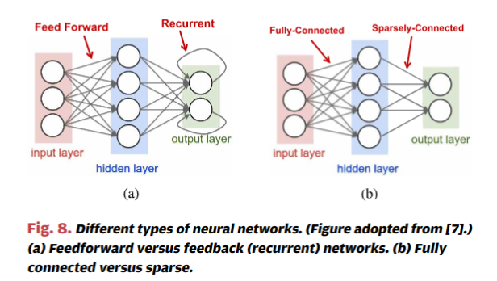

我們也可以通過限制影響輸出的權重數量來讓計算更加高效。如果每個輸出只是一個固定大小的窗口對應的輸入函數，則會產生這種結構性稀疏性。此外，若每個輸出的計算都使用相同的一組權重，便能顯著減少權重存儲的需求。這種重複使用相同權重的方式稱為權重共享，能夠大幅減少權重的存儲需求。

一種非常流行的窗口化與權重共享的 DNN 層是將計算結構化為卷積，如 Fig. 9(a) 所示。每個輸出激活的加權總和是透過僅僅一小部分輸入激活的鄰域來計算（即，超出鄰域的所有權重設為零）；這個鄰域常稱為“接受領域”。此外，每個輸出的相同一組權重是共享的（即，濾波器是空間不變的）。這樣的卷積層稱為卷積 (CONV) 層。

圖9 CNNs 中的高維卷積 (2D 傳統影像處理 vs. CNN 中的高維卷積)​
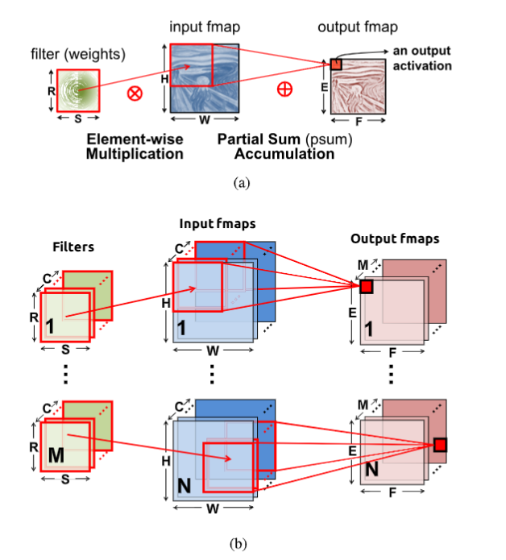

A. 卷積神經網路 (CNNs) 的介紹

卷積神經網路 (CNNs) 是深度神經網路 (DNNs) 的一種常見形式，其結構由多個卷積層 (CONV layers) 組成，如圖 10 所示。

圖10 卷積神經網絡 (CNN) 的結構示意圖​
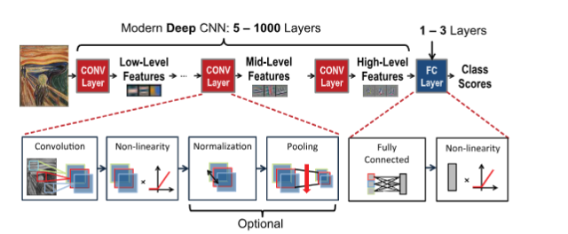

主要用於處理視覺相關的任務，例如圖像辨識、物體檢測和影像分類。CNN 神經網路模仿人類視覺系統對圖像的處理方式，能夠自動從圖像中提取出不同層次的特徵，並用於對圖像進行分類或其他任務。

CNN 神經網路的結構由多層神經元組成，每層神經元負責不同的計算，這種層次化結構使 CNN 神經網路能夠逐步從低階特徵中提取資訊，再進一步聚合成高階的抽象特徵，最終完成對整個圖像的理解。

而 CNN 神經網路的優勢在於能自動學習和提取圖像中的關鍵特徵，如形狀、紋理和顏色，而無需人工設計特徵。它通過卷積層高效處理大型圖像數據，避免傳統神經網路因參數過多而計算量過大的問題。此外，CNN 神經網路還具有強大的泛化能力（generalization），能夠在不同場景和數據上保持高準確率，實現對新圖像的準確預測。

卷積神經網路的架構通常由以下三個主要層次組成，每一層都在不同的層級上提取圖像特徵，逐步提高模型的識別能力。

卷積層（Convolution Layer）

卷積層是卷積神經網路的核心，它負責自動提取圖像的局部特徵。透過卷積運算，模型會使用稱為「卷積核」的小矩陣在輸入圖像上滑動，逐一捕捉局部範圍內的特徵，例如邊緣、角落等。卷積層能有效減少圖像的資訊量，同時保留重要的特徵，並且支援多層疊加，從淺層的低階特徵（如顏色和紋理）到深層的高階特徵（如形狀和物體輪廓），逐層加深特徵的抽象程度。

池化層（Pooling Layer）

池化層主要用於進一步縮小特徵圖的尺寸，減少計算量的同時、避免過擬合（over fitting）。最常用的是最大池化（Max Pooling），即在一個小區域內取最大值作為該區域的代表，這有助於過濾雜訊，增強模型對於平移不變性（translation invariance）的穩健性（robustness）。經過池化層，特徵圖的尺寸大幅縮減，同時保留了最重要的資訊。

全連接層（Fully Connected Layer）

全連接層位於卷積神經網路的尾端，用於將經過卷積和池化的特徵進行分類或預測。此層將所有的輸入特徵「攤平」，並將其連接到一個或多個神經元，最終輸出對應於每個分類的概率。全連接層通常配合 Softmax 函式來確定最終的分類結果。

B. 著名的 DNN 模型


DNN 結構的多樣性

- 架構差異：
  不同 DNN 模型在以下方面有所不同：
- 層數（深度）
- 層類型（卷積層、全連接層等）
- 層的形狀（如濾波器大小、通道數與濾波器數量） 補充 濾波器的作用-濾波器的作用是提取輸入數據中的局部特徵，例如邊緣、顏色模式、紋理等。在影像處理中，它們用於識別圖片中不同層級的特徵。
- 層與層之間的連接方式

模型發展趨勢

1.增加深度：

- 更深的網路通常能提升準確性，因為它們能學習更具層次性且更具辨識力的特徵表達。

2.卷積層為主：

- 大多數計算資源與權重集中於卷積層，而全連接層的比重逐漸減少。

3.創新技術：

- Bottleneck 機制：減少權重數量，提高效率。 (ResNet )
- 殘差連接：解決梯度消失，支持更深層的網路。 (https://hackmd.io/@steven0129/Sy_PrizoB)
- 平行處理 (Inception 模組)：多尺度處理輸入，提高特徵提取能力。

## 第四節 DNN 開發資源

促進深度神經網路 (DNN) 快速發展的關鍵因素之一是研究社群與產業所提供的一系列開發資源。這些資源不僅對 DNN 的發展至關重要，還為 DNN 加速器的開發提供了支持，透過以下方式發揮作用：

1. 提供工作負載的特性描述。
2. 促進對模型複雜性與準確性之間權衡的探索。

A. 框架（Frameworks）
DNN 開發框架提供便捷的工具和功能，幫助研究者和應用開發者快速設計與共享訓練過的模型。
這些框架還對高性能和高效率的 DNN 計算引擎的工程實現起到關鍵作用。

1.主要框架簡介：

- Caffe
  - 發布年份：2014 年，由 UC Berkeley 開發。
  - 語言支持：C、C++、Python、MATLAB。

- TensorFlow
  - 發布年份：2015 年，由 Google 開發。
  - 語言支持：C++、Python。
  - 特點：支持多 CPU 和 GPU，使用數據流圖管理多維張量，靈活性高。

- Torch / PyTorch
  - Torch：由 Facebook 與 NYU 開發，支持 C、C++、Lua。
  - PyTorch：Torch 的後繼者，主要使用 Python 開發。

- 其他框架：如 Theano、MXNet、CNTK 等，也提供強大的功能。

- 高層封裝庫：如 Keras（支持 TensorFlow、CNTK 和 Theano），用於簡化開發並加速實現。

2.框架的價值：

- 提供標準化的開發環境，便於研究者與開發者高效合作。
- 通過內建操作（如卷積層處理）支持軟硬體加速（如 Nvidia cuDNN 和專用硬體加速器）。
- 為硬體研究提供基準工作負載，有助於硬體/軟體權衡的探索與分析。

B. 模型（Models）

1.預訓練模型：

- 各種框架提供的網站可下載多種預訓練 DNN 模型。
- 同一模型（例如 AlexNet）因訓練方式不同，其準確率可能相差 1%～2%。

C. 圖像分類數據集（Popular Data Sets for Classification）

1.重要性：

- 使用公開數據集評估模型準確率有助於進行公平比較。
- 數據集的難度會影響 DNN 模型的大小與運算需求，並進一步影響效能與能耗。

2.常見數據集簡介：

- MNIST
  - 任務：手寫數字分類（10 個類別）。
  - 規模：60,000 張訓練圖像、10,000 張測試圖像。
  - 特點：經驗證準確率已從最初的 99.05% 提升到 99.79%，現在被認為是相對簡單的數據集。

- CIFAR-10
- 任務：多類別物體分類（10 個類別）。
- 規模：50,000 張訓練圖像、10,000 張測試圖像。
- 特點：最初準確率為 64.84%，現已提升至 96.53%。

- ImageNet
  - 任務：大規模圖像分類（1000 個類別）。
  - 規模：130 萬張訓練圖像、10 萬張測試圖像、5 萬張驗證圖像。
  - 測量方式：
  - Top-5 錯誤率：前五個預測中包含正確類別即為正確。
  - Top-1 錯誤率：預測的第一類別必須正確。
  - 特點：2012 年的 AlexNet 模型 Top-5 準確率為 83.6%，到 2017 年提升至 97.7%。

3.結論：

- MNIST 是簡單數據集，而 ImageNet 是挑戰性更大的數據集。比較模型準確率時需考慮數據集的特性與難度。

D. 其他任務數據集（Data Sets for Other Tasks）

1.進階任務數據集：

- 單物體定位（Single-Object Localization）
  - 必須定位並分類圖像中的目標物體（1000 個類別）。

- 物體檢測（Object Detection）
  - 必須定位並分類圖像中所有物體（200 個類別）。

- 其他常見數據集：

- PASCAL VOC
  - 任務：物體檢測。
  - 規模：11,000 張圖像，20 個類別（27,000 個物體實例）。

- MS COCO
  - 任務：物體檢測、分割與上下文識別。
  - 規模：328,000 張圖像，250 萬個標註實例，91 個物體類別。

- Google 開放影像數據集
  - 規模：900 萬張圖像，涵蓋 6000 個類別。

- YouTube 數據集
  - 規模：800 萬部影片（50 萬小時），涵蓋 4800 類別。

- Google 音頻數據集
  - 規模：632 種音頻事件類別，200 萬段 10 秒音頻片段。

3.未來展望：

- 更大規模與跨領域的數據集將成為未來 DNN 開發的重要資源，有助於探索更高效的模型與引擎設計。

## 第五節 DNN 硬體處理技術

### A

由於深度神經網路（DNN）的普及，許多現代硬體平台新增了專門針對 DNN 處理的功能。例如：

- Intel Knights Mill CPU 提供專用的深度學習向量指令 [73]。
- Nvidia PASCAL GP100 GPU 支援 16 位浮點數（FP16）運算，能在單一精度核心上執行兩次 FP16 運算，顯著提升深度學習的計算速度。
- 專為 DNN 處理設計的系統包括 Nvidia DGX-1 和 Facebook 的 Big Basin 定制 DNN 伺服器 [74]。

此外，DNN 的推論能力已經被實現於多種嵌入式系統晶片（SoCs），如 Nvidia Tegra 和 Samsung Exynos，
以及現場可程式邏輯閘陣列（FPGAs）。
因此，瞭解這些平台的處理方式，以及如何設計針對 DNN 的應用特定加速器（ASIC），對於進一步提升吞吐量和能源效率非常重要。

核心運算單元與架構類型

DNN 的卷積層（CONV）和全連接層（FC）主要依賴 乘加運算（MAC），該運算易於平行化。
為實現高效能，常見的設計採用了高度平行的計算架構，主要分為以下兩類：

1.時間架構（Temporal Architectures）

- 常見於 CPU 和 GPU 中。
- 通過向量處理（SIMD）或平行執行緒處理（SIMT）等技術提升平行度。
- 採用集中控制方式管理大量算術邏輯單元（ALUs），這些 ALUs 只能從記憶體層級獲取資料，無法彼此直接通信。

2.空間架構（Spatial Architectures）

- 常見於 ASIC 和 FPGA 設計中。
- 使用資料流處理（Dataflow Processing），使 ALUs 形成處理鏈，可以直接傳遞資料。
- 每個 ALU 可以擁有獨立的控制邏輯和本地記憶體（如暫存器或快取）。配備本地記憶體的 ALU 稱為 處理引擎（Processing Engine, PE）。

平台優化策略
不同硬體平台的設計策略各有側重，在不影響計算精度（產生位元層級相同的結果）的前提下，專注於以下優化方向：

1.時間架構（CPUs 和 GPUs）

- 通過計算內核的轉換減少乘法次數，從而提高運算吞吐量。

2.空間架構（加速器，如 ASIC 和 FPGA）

- 利用資料流設計提高數據重用率，減少高成本記憶體的訪問次數，從而降低能源消耗。

DNN 的硬體處理技術不斷演進，針對不同架構的優化設計，確保其效能最大化：

- 在 CPU 和 GPU 等時間架構中，側重於平行化運算和內核優化。
- 在 ASIC 和 FPGA 等空間架構中，專注於資料流處理與記憶體利用效率。

A. 在 CPU 和 GPU 平台上加速內核計算

CPU 和 GPU 使用如 SIMD（單指令多資料流） 或 SIMT（單指令多執行緒）
等平行化技術，來實現同時執行多個乘加運算（MAC）。
這些平台上的所有算術邏輯單元（ALUs）共用相同的控制邏輯和記憶體（暫存器檔）。
在這些硬體上，全連接層（FC 層）和卷積層（CONV 層）通常會被映射為矩陣乘法（即內核計算）。

圖展示了如何將矩陣乘法用於 FC 層：

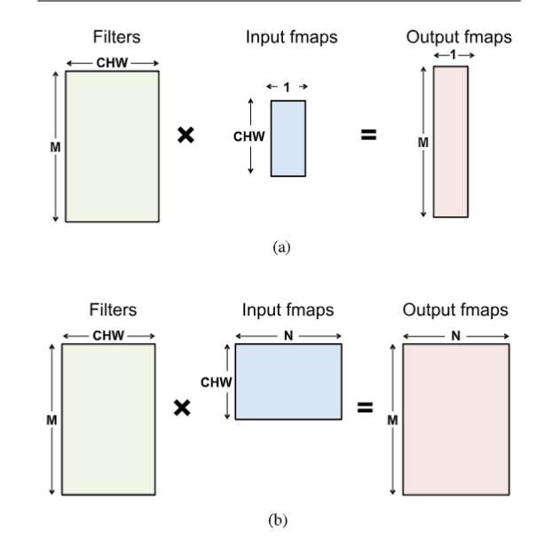

- 濾波器矩陣的高度對應於 3D 濾波器的數量，寬度則是每個 3D 濾波器的權重數量（輸入通道數C × 寬度𝑊 × 高度𝐻，因為在 FC 層中𝑅=𝑊 且𝑆=𝐻）

- 輸入特徵圖矩陣的高度是每個 3D 輸入特徵圖中的激活數量（𝐶×𝑊×𝐻），寬度則是 3D 輸入特徵圖的數量（圖 a 中為 1，圖 b 中為𝑁）。

- 輸出特徵圖矩陣的高度是輸出特徵圖的通道數（𝑀），寬度則是 3D 輸出特徵圖的數量（𝑁）。在 FC 層中，每個輸出特徵圖的尺寸為1×1× 輸出通道數𝑀。

在 DNN 中，卷積層（CONV 層）也可以被映射為矩陣乘法，這通常使用放寬形式的 Toeplitz 矩陣（常對角矩陣）來實現，

如圖所示。

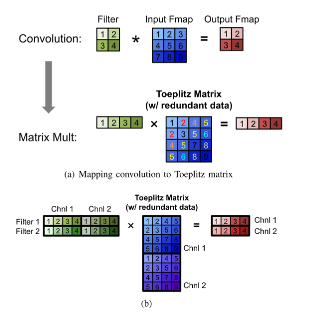

然而，將 CONV 層映射為矩陣乘法會產生一個問題：
輸入特徵圖矩陣中存在冗餘數據（如 圖a 所示的高亮部分）。這種冗餘可能導致存儲效率低下或記憶體訪問模式變得複雜。

就是這樣的運算很多餘的概念

有許多專為 CPU（例如 OpenBLAS、Intel MKL 等）和 GPU（例如 cuBLAS、cuDNN 等）設計的軟體庫，可以優化矩陣乘法。
這些平台上的矩陣乘法會依據存儲層級（通常為數百 KB 到數 MB）進行分塊處理。

在這些平台上，透過對數據應用計算轉換，可以進一步加速矩陣乘法，減少乘法次數，同時保證位元結果相同。
然而，這通常會以增加加法次數及數據訪問模式更不規則為代價。

快速傅里葉變換（FFT） 是一種知名的方法，如圖所示

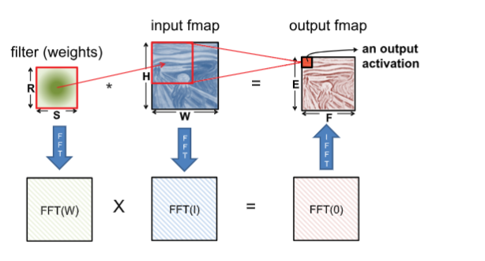

它將乘法次數從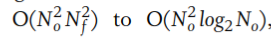 輸出大小為𝑁𝑜×𝑁𝑜 ，濾波器大小為𝑁𝑓×𝑁𝑓​

執行卷積時，首先對濾波器和輸入特徵圖進行 FFT，然後在頻域中進行乘法，
最後對結果應用逆 FFT（IFFT），以恢復空間域中的輸出特徵圖。
然而，使用 FFT 存在以下缺點：

1. 濾波器越小，FFT 的效益越低；
2. FFT 的大小由輸出特徵圖的大小決定，通常遠大於濾波器；
3. 頻域中的係數為複數，增加了計算和存儲複雜性。

因此，儘管 FFT 減少了計算量，但需要更大的存儲容量和帶寬。
此外，一種常見的降維方法是使權重稀疏化，但 FFT 的使用使得稀疏性難以被利用。
針對 FFT，有幾種優化策略可以提高其在 DNN 中的效率：

1.可以預先計算並存儲濾波器的 FFT；
2.輸入特徵圖的 FFT 可計算一次並用於生成輸出特徵圖的多個通道；
3.由於圖像僅包含實值，其傅里葉變換具有對稱性，可利用這一點減少存儲和計算成本。

與 FFT 類似，Winograd 演算法對特徵圖和濾波器應用轉換，減少卷積所需的乘法次數。
Winograd 以塊為基礎運行，乘法減少的幅度取決於濾波器和塊的大小。
塊越大，乘法減少越多，但轉換複雜性也越高。特別有吸引力的是 3×3 的濾波器，當計算
2×2 的輸出塊時，乘法次數可減少2.25×。需要注意的是，Winograd 需要針對濾波器和塊大小進行特殊處理。

Strassen 演算法也被用於減少 DNN 中的乘法次數。它以遞歸方式重新排列矩陣乘法的計算，將乘法次數從
𝑂(𝑁3)降至𝑂(𝑁2.807)。然而，Strassen 的優勢以增加存儲需求和有時降低數值穩定性為代價。

實際應用中，不同層的形狀和大小可能使用不同的演算法
（例如，FFT 適用於濾波器大於5×5，Winograd 適用於3×3或更小的濾波器）。
現有平台庫（如 MKL 和 cuDNN）會動態選擇適合特定形狀和大小的演算法。

### B. Energy-Efficient Dataflow for Accelerators（DNN 加速器的節能數據流設計）

#### **1. 為什麼 DNN 的計算瓶頸是記憶體存取？**

我們一般認為「**計算**」是運行 AI 模型的主要成本，但其實不是。\
**真正昂貴的是「記憶體存取」**，尤其是**讀取和寫入 DRAM**。

##### **記憶體存取的基本流程**

DNN 中的 **每一次 MAC（乘加運算 Multiply-and-Accumulate）**，都需要從記憶體取得數據，然後再寫回結果：

- **讀取 3 次：**
  1. 讀取「濾波器權重」（Weight）
  2. 讀取「輸入特徵圖的 Activation 值」
  3. 讀取「部分和 Partial Sum」（累加前的結果）
- **寫入 1 次：**
  4\. 把「累加後的新 Partial Sum」寫回記憶體

這些存取操作在**不同記憶體層級**（如 DRAM、SRAM）上進行，而 **DRAM 存取的能源消耗極高**，比計算本身高出數個數量級。

##### **以 AlexNet 為例**

- **計算量**： 724M MACs（7.24 億次乘加運算）
- **記憶體存取次數**：**3000M DRAM 存取**（30 億次！）
- \*\*能量消耗：\*\*DRAM 存取比計算本身要高好幾倍，導致能效極差

---

#### **2. 如何透過「記憶體層級架構」來解決這個問題？**

既然 DRAM 存取這麼貴，我們應該**盡量避免頻繁訪問 DRAM**，而是：

1. **把數據存到較便宜的記憶體**（如內部 SRAM）
2. **盡可能在這些較低層級的記憶體中重複使用數據**

#### **加速器的記憶體架構**

如 **圖 22** 所示，DNN 加速器通常有**多層次的記憶體**：

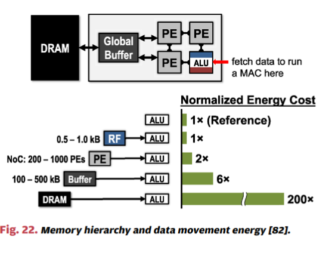

- **全域緩衝區（Global Buffer）：** 容量較大（數百 KB），連接 DRAM，但存取能耗仍較高。
- **PE（Processing Element）間網絡：** 各處理單元之間可以直接傳遞數據，避免繞回 DRAM。
- **PE 內部的暫存器（Register File, RF）：** 只有數 KB，但存取能耗最低，適合頻繁讀寫。

##### **能耗比較**

- **DRAM 存取的能量消耗是 RF 存取的數百倍**
- **如果能夠在 RF 或 PE 間完成運算，就能大幅減少 DRAM 存取，提升能效**

---

#### **3. 如何讓數據重複使用？（Data Reuse）**

要減少 DRAM 存取，就必須在低能耗記憶體中**盡可能重複使用數據**。\
這裡有 **三種主要的數據重複使用方式**（如 **圖 23** 所示）：

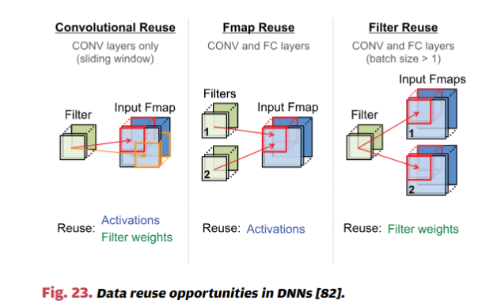

##### **(1) 卷積重複使用（Convolutional Reuse）**

- **概念：** 在卷積層內，輸入特徵圖的 Activation 和濾波器的權重，會以**不同的組合**多次使用。
- **舉例：**
  - 假設有一張 \(5×5\) 的輸入圖像，使用 \(3×3\) 的濾波器滑動卷積
  - 這個 \(3×3\) 濾波器會**多次使用**（滑動應用到不同區域）

##### **(2) 特徵圖重複使用（Feature Map Reuse）**

- **概念：** 當 DNN 的多個濾波器應用到**相同的輸入特徵圖**時，可以重複使用 Activation 值。
- **舉例：**
  - AlexNet 的每一層有許多不同的濾波器，但這些濾波器都對應**同一張特徵圖**，因此輸入特徵圖的 Activation 可以多次使用。

##### **(3) 濾波器重複使用（Filter Reuse）**

- **概念：** 當一次處理多個輸入特徵圖（batch processing）時，相同的濾波器權重可以在不同的特徵圖上多次使用。
- **舉例：**
  - 在訓練過程中，DNN 會同時處理多張影像（Batch），但這些影像可以使用**相同的濾波器**來提取特徵。

#### **4. 這樣做能帶來多少效能提升？**

如果我們能夠有效利用本地記憶體進行數據重複使用，能夠顯著減少 DRAM 存取，並提升能源效率。

##### **AlexNet 的案例**

- **卷積層（CONV layers）的 DRAM 存取量可以減少 500 倍**
- **從 3000M（30 億次）DRAM 存取降至 61M（6100 萬次）**
- **大幅減少能耗，同時提升執行速度**

這意味著：\
✅ 記憶體存取的時間與能耗降低\
✅ DNN 模型可以在更低功耗的設備上運行（如手機、邊緣 AI 裝置）

#### **5. DNN 加速器 vs. 傳統處理器**

加速器的設計與**一般 CPU 處理器的工作方式相似**，但**目標不同**：

- **一般處理器（CPU / GPU）**
  - **編譯器（Compiler）** 負責將程式轉換為機器碼（x86, ARM）
  - **主要優化效能**
- **DNN 加速器**
  - **映射器（Mapper）** 負責將 DNN 模型的結構對應到硬體計算
  - **主要優化能源效率**

這表示，DNN 加速器的工作方式更接近於「**計算圖（Computation Graph）映射**」，將數據流最佳化，確保最低的記憶體存取成本。

#### **6. 總結**

✅ **記憶體存取是 DNN 的最大瓶頸**，比計算本身的能量消耗還高。\
✅ **加速器透過本地記憶體層級（RF、PE 間網絡）來減少 DRAM 存取**，降低功耗。\
✅ **透過「卷積重複使用、特徵圖重複使用、濾波器重複使用」來最佳化數據存取**，可減少 500 倍的 DRAM 存取。\
✅ **DNN 加速器的映射器（Mapper）負責將 DNN 計算高效對應到硬體，與一般 CPU 的編譯器（Compiler）類似，但目標是降低能耗。**

圖23 DNN 的數據重用機會
圖24 DNN 加速器的運行與通用處理器的對應關係
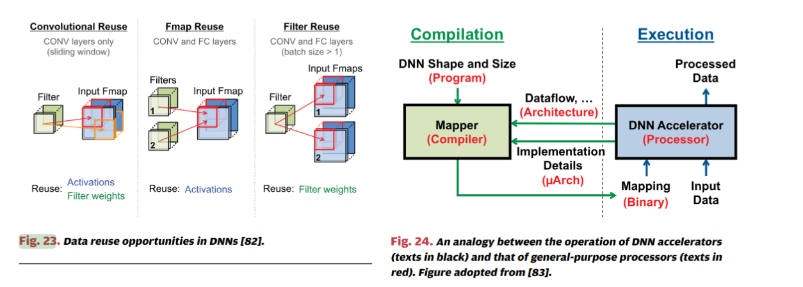

圖25 DNN 的不同數據流模型 (Weight Stationary, Output Stationary, No Local Reuse)​
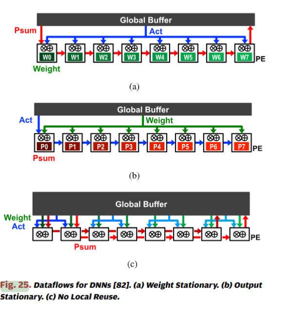

這些技術為**邊緣 AI、手機 AI 和低功耗推理設備的發展**，提供了關鍵的硬體設計方向！ 🚀


## **VI. Near-Data Processing - 近資料處理**

#### **1. 概述**
在 DNN（深度神經網路）運算中，**數據移動（data movement）** 佔據了大部分的能量消耗。因此，本章探討 **近資料處理（Near-Data Processing, NDP）** 技術，旨在減少數據移動的成本，提高計算效率。這類技術主要圍繞 **混合信號電路（mixed-signal circuits）** 和 **新型記憶體技術（advanced memory technologies）**，透過將計算單元移動至資料儲存的地方來降低能耗。

### **2. 主要技術與應用**
NDP 主要透過三種方式來縮短數據傳輸距離，提高運算效率：

| 方法 | 主要概念 | 代表技術 |
|------|--------|--------|
| **記憶體內計算 (Processing-in-Memory, PIM)** | 將計算單元整合進記憶體，以減少存取 DRAM 的需求 | **eDRAM、3D 堆疊記憶體 (3D DRAM)、Memristors** |
| **計算靠近記憶體 (Compute-Near-Memory, CNM)** | 在記憶體周圍加入專門的計算單元，降低數據傳輸成本 | **Hybrid Memory Cube (HMC)、High Bandwidth Memory (HBM)** |
| **感測器內計算 (Processing-in-Sensor, PIS)** | 直接在感測器內部進行資料處理，減少數據傳輸 | **Edge AI、低功耗 AI 晶片** |

---

### **3. 主要技術細節**
#### **(A) DRAM 內運算**
- **內嵌式 DRAM (Embedded DRAM, eDRAM)**
  - 與傳統 DRAM 相比，eDRAM 具備更高的頻寬與更低的存取能量，但在製造成本與耐用性上有所限制。
  - **應用：** 用於 AI 加速器中的快取記憶體，減少存取外部 DRAM。

- **3D 堆疊記憶體 (3D Stacked DRAM)**
  - 透過 **矽穿孔 (Through-Silicon Via, TSV)** 技術，將多層記憶體垂直堆疊，提升記憶體頻寬並降低能量消耗。
  - 例如：
    - **Hybrid Memory Cube (HMC)**：可提供比傳統 DRAM **高 10 倍頻寬**，同時能量消耗降低至 **1/5**。
    - **High Bandwidth Memory (HBM)**：被應用於 **NVIDIA GPU、AMD AI 加速器** 中，以提升 DNN 計算效率。

- **應用案例：**
  - **Neurocube**：將 SIMD（單指令多數據）運算單元直接整合至 HMC 內部，使記憶體與計算單元更加緊密結合。
  - **Tetris**：利用 Eyeriss 架構，優化記憶體配置，提升能效 **1.5 倍**，吞吐量提升 **4.1 倍**。

---

#### **(B) SRAM 內運算**
- **將運算單元直接整合進 SRAM 陣列**
  - 例如，將 MAC（乘加）運算直接內嵌於 SRAM Bit Cell。
  - **優勢：**
    - 減少資料搬移的能量消耗，達到 **12 倍能效提升**。
    - 可以進行類比計算，減少數據轉換成本（如 ADC/DAC）。

- **應用案例：**
  - **特殊設計的 SRAM 單元**：透過 DAC（數位類比轉換器）來處理數據，利用類比電壓來代表輸入數值，進一步提升運算能效。

---

#### **(C) 非揮發性電阻記憶體 (Memristors)**
- **利用阻變式記憶體 (ReRAM) 進行計算**
  - 透過類比運算方式，讓電阻的導通值代表 DNN 權重（weight），電壓作為輸入，電流作為輸出。
  - **特點：**
    - **極端高效的記憶體計算架構**（weights 可以常駐記憶體，無須來回搬移）。
    - 具有 **高密度、低功耗** 優勢，可與 DRAM 相媲美。

- **應用案例：**
  - **ISAAC**：將 memristors 取代 eDRAM 來進行點積運算，透過 16-bit dot product 設計提升運算精度。
  - **PRIME**：將 memristors 當作主要記憶體，並且支援 4-bit 計算模式。

---

#### **(D) 感測器內計算 (Processing-in-Sensor)**
- **在感測器內進行 AI 推論**
  - 直接在影像感測器內進行資料處理，以降低傳輸影像到雲端或主機的能量消耗。
  - **應用：**
    - **自駕車、無人機、監控系統** 等低延遲應用。
    - 例如 **Apple A 系列晶片、Google Edge TPU、Sony AI 相機感測器**。

---

### **4. 挑戰與未來發展**
雖然近資料處理技術帶來顯著的能效優勢，但仍面臨一些挑戰：
- **類比計算的精度問題**：
  - 受限於電路不理想性，類比計算的精度低於傳統數位計算，因此需要透過 **低精度訓練、量化技術** 來提升準確度。
- **數據轉換成本 (ADC/DAC Overhead)**：
  - 許多類比運算技術仍然需要數位轉換（如 ADC/DAC），這會帶來額外的能量消耗。
- **記憶體技術的可行性與耐用性**：
  - 例如 Memristors 仍處於研發階段，在商業化上仍需克服生產與耐用性的問題。

未來發展方向：
1. **進一步提升類比計算精度**
2. **降低 ADC/DAC 成本**
3. **提高記憶體計算技術的成熟度**
4. **發展新型低功耗 AI 晶片**

---

### **5. 結論**
近資料處理技術為 DNN 計算帶來了新的可能性，透過降低數據移動成本來提升運算效率與能效。未來，隨著 **3D 堆疊記憶體、類比運算、感測器內 AI 計算** 的進步，DNN 硬體架構將朝著更高效、更低功耗的方向發展。

## **解析 VII. CODESIGN OF DNN MODELS AND HARDWARE（DNN 模型與硬體的共同設計）**

### **1. 章節概述**
傳統的 DNN 設計主要關注於提升準確度，而較少考量硬體的實作複雜度。然而，這可能導致難以部署的模型。為了提高 DNN 在不同應用中的可行性，近年來的研究強調 DNN 模型與硬體的共同設計（codesign），以同時提升準確度與運算效能，同時降低能耗與成本。本章節探討各種針對 DNN 模型與硬體 codesign 的方法。

### **2. 主要技術類別**
DNN 模型與硬體的 codesign 主要可以分為兩大方向：
1. **降低運算與數值的精度**（Reduce Precision）  
   - 包括從浮點數（floating point）轉換為定點數（fixed point）、減少位元數（bitwidth）、非均勻量化（nonuniform quantization）及權重共享（weight sharing）。
2. **減少運算量與模型大小**（Reduce Number of Operations and Model Size）  
   - 採用壓縮（compression）、剪枝（pruning）、以及設計更緊湊的網路結構（compact network architectures）。

---

### **A. 降低數值精度（Reduce Precision）**
#### **1. 量化（Quantization）**
量化的目標是將數據映射到較少的數值範圍，以減少所需的存儲空間與計算成本。減少精度的主要優勢包括：
- **降低儲存成本**
- **減少計算需求**
  
常見的量化方式包括：
- **均勻量化（Uniform Quantization）**  
  - 所有量化等級之間的間距相等（如圖 37(a)）。
- **對數量化（Log Quantization）**  
  - 採用對數函數來調整間距，使得小數值的精度更高，如圖 37(b)。
- **學習型量化（Learned Quantization）**  
  - 透過 k-means 分群等方式根據數據分布決定量化等級，如圖 37(c)。

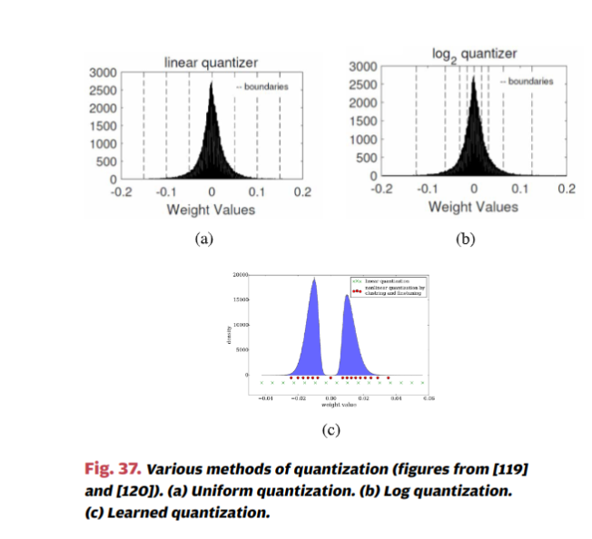

此外，量化可分為：
- **固定量化（Fixed Quantization）**：所有數據類型（如層、濾波器、通道）都使用相同的量化方式。
- **變動量化（Variable Quantization）**：不同的層、濾波器、通道可能使用不同的量化方式。

#### **2. 降低運算數據精度**
研究顯示，降低權重精度比降低激活值（activation）的精度更有優勢，因為權重佔據較大的存儲空間。此外，大多數研究著重於減少推論（inference）時的精度，而非訓練（training），因為梯度對數值量化較為敏感。

減少數值精度的具體方法可參見**表 3**，其中針對 AlexNet 測試了不同數值精度對 Top-5 準確度的影響。

圖38 數據表示方法 (32-bit 浮點 vs. 8-bit 動態定點)​
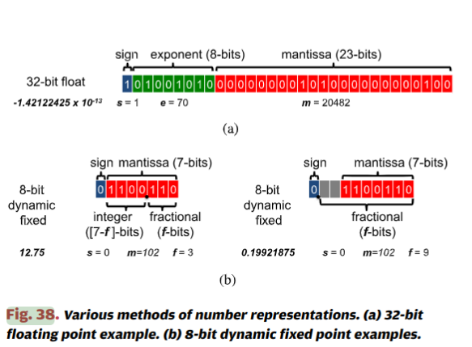

圖39 減少 MAC 計算的精度
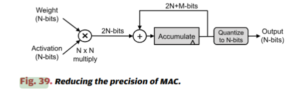

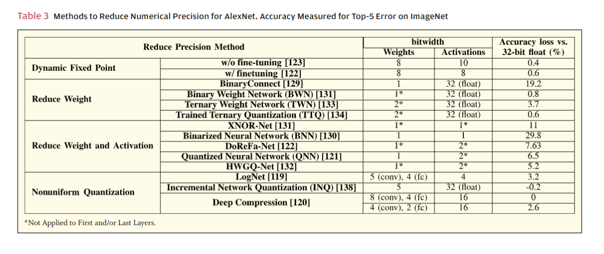
---

### **B. 減少運算量與模型大小（Reduce Number of Operations and Model Size）**
#### **1. 剪枝（Pruning）**
剪枝技術透過移除對輸出影響較小的權重，來減少運算量與存儲需求，常見方式包括：
- **Fine-Grained Pruning（細粒度剪枝）**：個別刪除單個權重，能大幅降低運算量但不易在硬體上高效執行。
- **Coarse-Grained Pruning（粗粒度剪枝）**：刪除整個權重區塊，例如整列、整列通道或整個濾波器，能更有效地與硬體架構匹配。

特定硬體（如 EIE、SCNN）設計可在不解壓縮的情況下直接處理稀疏矩陣運算。

#### **2. 網路壓縮（Compression）**
許多研究利用數值壓縮技術來減少 DNN 模型的存儲需求，如：
- **稀疏矩陣壓縮（Sparse Matrix Compression）**：採用壓縮稀疏行（CSR）或壓縮稀疏列（CSC）格式來減少記憶體存取需求。
- **權重共享（Weight Sharing）**：使用類似於 k-means 的分群方法來減少需要存儲的不同權重數量。

#### **3. 緊湊型網路架構（Compact Network Architectures）**
減少 DNN 模型大小的一種有效方式是優化網路架構，例如：
- **使用較小的卷積核（filter）**：以更小的卷積核替換較大的卷積核，例如用兩個 \(3 \times 3\) 卷積層替換一個 \(5 \times 5\) 層。
- **分解卷積（Decomposed Convolution）**：將 \(N \times N\) 卷積核分解成兩個 1D 卷積核（如 \(1 \times N\) 和 \(N \times 1\)）。
- **深度可分離卷積（Depthwise Separable Convolution）**：如 MobileNet、Xception 這類模型使用的技術，可顯著減少運算量。

---

### **C. 總結**
DNN 的模型與硬體 codesign 旨在同時考慮準確度、能源效率與運算效能，主要策略包括：
1. **透過數值量化降低精度**
2. **透過剪枝與壓縮減少運算量**
3. **透過網路結構優化減少參數與計算需求**

這些技術的目標是讓 DNN 更適合在嵌入式設備、雲端加速器等場景中運行，以提高實際應用的可行性。

---

## **VIII. Benchmarking Metrics for DNN Evaluation and Comparison**

這一章主要探討了 **評估 DNN（深度神經網路）模型與硬體效能的基準指標**，以確保研究人員在比較不同的 DNN 設計時，能夠考慮所有關鍵因素，並做出公正的評估。以下是主要分析點：

---

### **1. 需要考量的關鍵評估指標**
不同的 DNN 設計可能在某些方面表現優異，但在其他方面有所折衷，因此必須綜合評估以下關鍵指標：
- **準確度與穩健性（Accuracy & Robustness）**
- **功耗與能耗（Power & Energy Consumption）**
- **吞吐量與延遲（Throughput & Latency）**
- **成本（Cost）**

#### **(1) 準確度與穩健性**
- 必須在**公認的數據集**上評估準確度，例如 **ImageNet**，而非較簡單的 **MNIST**（手寫數字識別）。
- 需確保比較時使用**相同的數據集與任務**，避免因數據集難度不同而造成誤導。
- 若主要目標是評估**硬體創新**，則建議使用已被廣泛測試的 DNN **（如 AlexNet、GoogLeNet）** 來比較不同硬體的影響。

#### **(2) 能耗與功耗**
- **邊緣運算（Edge Computing）** 和 **雲端運算（Cloud Computing）** 的需求不同：
  - **邊緣設備**（如手機、感測器、無人機）電池容量有限，需要低功耗設計。
  - **雲端數據中心** 受到散熱和能耗上限的約束。
- 因此，在比較 DNN 硬體時，應報告**整體系統能耗**，包括：
  - **晶片功耗**
  - **外部記憶體（如 DRAM）訪問次數**，因為記憶體讀取耗能比計算大許多。

#### **(3) 吞吐量與延遲**
- **高吞吐量（Throughput）**：影響應用如**導航、機器人、數據分析**等，特別是處理大量影像時，吞吐量越高，能分析的數據量越多。
- **低延遲（Latency）**：影響**即時互動應用**，如自動駕駛、即時監控等。
  - 延遲定義為**從影像輸入到結果輸出的時間**，以秒為單位。
  - 吞吐量通常以「每秒處理次數」計算。
  - **批量處理（Batch Processing）** 提高吞吐量，但可能增加延遲。例如：
    - 30 fps（每秒 30 幀）但批次大小為 100，會導致 3 秒的延遲，對即時應用（如導航）不可接受。

#### **(4) 成本**
- 晶片成本主要受以下因素影響：
  - **片上儲存量（On-chip Storage）**：較大記憶體可以降低外部記憶體存取需求，但增加製造成本。
  - **計算核心數（Core Count）**：影響吞吐量，但若記憶體頻寬不足，則計算核心再多也無法全速運行。

---

### **2. DNN 模型的評估指標**
為了公平比較 DNN 模型，應該報告以下指標：
1. **準確度（Accuracy）**：
   - 例如 **ImageNet** 的 Top-5 錯誤率。
   - 是否使用增強技術（如多重裁剪、多模型集成）。
   
2. **網路架構（Network Architecture）**：
   - 層數、卷積核大小、通道數等。

3. **模型權重數量（Weights Count）**：
   - 影響存儲需求。
   - 最好報告**非零權重數量（Nonzero Weights）**，因為這代表理論最小存儲需求。

4. **乘加運算次數（Multiply-Accumulate Operations, MACs）**：
   - 反映計算量與吞吐量需求。
   - 也應報告**非零 MACs**，代表理論最小計算需求。

> **示例表格**：論文提供了一些主流 DNN 的這些指標比較，例如 **AlexNet、GoogLeNet、ResNet** 等。

---

### **3. DNN 硬體的評估指標**
為了衡量 DNN **硬體** 的效率，還需要額外考量：
1. **功耗與能耗（Power & Energy Consumption）**
   - 測量時應報告 **DNN 模型的規格**，包括支援的層數與數據精度（如 8-bit, 16-bit）。
   - **記憶體存取量（DRAM 訪問次數）** 影響系統功耗。

2. **延遲與吞吐量**
   - 需考慮 **批次大小**（Batch Size）與 **真實運行時間**。
   - 這比單純報告峰值吞吐量更具實際參考價值。

3. **成本**
   - 晶片的 **面積效率（Area Efficiency）**：
     - 每個乘法單元所佔的面積（mm²）。
     - 記憶體類型（如寄存器、SRAM）與控制邏輯的占比。
   - 對於 FPGA 應報告資源利用率，如：
     - **DSP、BRAM、LUT、FF 的使用率**
     - **每單位面積運算量（GOPs/slice）**

---

### **4. 設備的綜合評估**
最後，DNN 設備是否適合特定應用的評估流程如下：
1. **準確度（Accuracy）**：決定能否勝任任務。
2. **延遲與吞吐量（Latency & Throughput）**：確保運行速度足夠。
3. **能耗與功耗（Energy & Power）**：影響設備是否適用於邊緣或雲端環境。
4. **成本（Cost）**：影響設備的市場接受度。

---

### **結論**
這一章強調了**全面性指標報告的重要性**，以避免偏頗的比較。例如：
- **僅報告高吞吐量但未考慮延遲**，可能不適用於即時應用。
- **僅報告低功耗但未考慮準確度**，可能無法勝任實際任務。
- **僅報告理論效能但未測量真實系統功耗與記憶體訪問量**，可能低估實際運行成本。

這些評估標準確保了 DNN 設計的透明度，幫助研究人員在不同設計間進行公正比較。

## **IX. Summary（總結）—— 深度神經網路（DNN）的現狀與未來展望**

這一章概括了 **深度神經網路（DNNs）** 在過去幾年的快速發展，以及為了提升效能與降低運算成本所採取的各種方法。DNNs 已經廣泛應用於 **電腦視覺、語音識別、機器人技術** 等領域，並在某些任務上達到了 **超越人類** 的準確度。然而，這種卓越的性能也伴隨著**高計算複雜度**，因此，設計出能夠**高效處理 DNNs 的硬體與演算法**，成為了當前的研究重點。

---

### **1. DNN 的應用與挑戰**
- DNN **目前已廣泛應用於 AI 領域**，如電腦視覺、語音辨識、機器人等。
- 雖然 DNN **能達到極高的準確度**，但需要**大量的計算資源**，導致**運算能耗高、延遲大、成本昂貴**。
- **關鍵挑戰**：如何**在不影響準確度的情況下**，提升**能源效率**、增加**計算吞吐量**，並且降低**硬體與部署成本**。

---

### **2. 設計高效 DNN 系統的關鍵考量**
設計一個高效的 DNN 系統，應從 **理解應用場景與計算需求** 開始：
- 本論文探討了當前與未來可能的應用，並特別關注**電腦視覺應用**。
- 討論了 DNN 的演算法和訓練數據的特性，這些因素在快速變化，設計時需考慮**未來趨勢**，以確保系統具備良好的**靈活性**。

在 DNN 設計的探索過程中，必須考量**四個主要系統指標**：
1. **準確度（Accuracy）**
2. **能源效率（Energy Efficiency）**
3. **吞吐量（Throughput）**
4. **硬體成本（Hardware Cost）**

論文回顧了這些指標的重要性，並分析了 DNN 計算負載的兩大核心組成：
1. **網路架構（Network Architecture）**：
   - 包括每一層的結構與層間的連接方式。
   - 這些架構的設計會根據應用需求變動。
2. **輸入數據（Input Data）**：
   - 訓練時與推論時的輸入數據分布可能有所不同，因此設計時需考量數據的變化。

---

### **3. DNN 運算最佳化技術**
本論文回顧了幾種**提升 DNN 運算效率的策略**，其中**數據移動（Data Movement）** 是影響能耗的主要因素。因此，研究重點在於 **如何在不影響準確度、吞吐量與成本的前提下減少數據移動**：
- **記憶體架構選擇**：使用**空間陣列架構（Spatial Array Architecture）**，以**提高數據重用率**，減少對高成本記憶體（如 DRAM）的存取需求。
- **最佳化數據流（Dataflow Optimization）**：
  - 提高低成本記憶體（如 SRAM、暫存器）的使用率，減少高能耗存取次數。
  - **分類數據流模式**，分析其特點，以選擇最適合的架構。

此外，論文還探討了**其他降低運算能耗的方法**：
- **數據表示最佳化**（Data Representation Optimization）：壓縮數據以減少存儲需求。
- **稀疏性技術（Sparsity）**：
  - 剪枝（Pruning）與壓縮（Compression）可以減少 DNN 權重與計算量。
  - 運用**權重與激活值的稀疏性**，降低不必要的計算次數，提高效率。

---

### **4. DNN 與硬體的共同設計（Codesign）**
DNN 運算具有很高的可變性，因此軟硬體共同設計（codesign）能提升效能：
- **提升稀疏性（Sparsity）**：在硬體層面，若 DNN 權重包含大量零值（Sparse Weights），可以設計**專門的硬體來跳過零值計算**，提高運算效率。
- **數據精度最佳化（Precision Optimization）**：
  - 透過降低數據的**位元數（bitwidth）**，例如從 32-bit 浮點數（FP32）降低至 8-bit 定點數（INT8），可以減少儲存需求並加快計算速度。
  - 採用更**複雜的數據映射方式**，讓低位元數據仍能保有高準確度。
- **軟體輔助（Software Assistance）**：
  - 在神經網路訓練過程中，調整權重或使用特殊的訓練方法，以適應硬體的數據表示方式，確保降低位元數後仍維持高準確度。

此外，論文也討論了 **DNN 訓練與推論的開源框架**，如 TensorFlow、PyTorch、Caffe 等，這些框架可以幫助研究人員開發與測試新的 DNN 架構。

---

### **5. 未來發展與新技術**
DNN 的發展也帶來了許多**新興技術**，用於進一步提升運算效率：
- **混合信號電路（Mixed-Signal Circuit）與新型記憶體技術**
  - 例如 **Memristor**（記憶電阻器）可用於類比計算，減少數字計算的功耗。
  - **3D 堆疊記憶體（3D-Stacked Memory）** 可提升記憶體頻寬，減少數據存取延遲。
- **計算靠近數據源（Near-Data Processing）**
  - 在感測器或記憶體內嵌入計算能力，直接在**數據源附近**執行運算，減少數據搬移的開銷。
  - 這種設計特別適用於 **物聯網（IoT）、邊緣運算（Edge Computing）** 等低功耗應用。

這些技術的發展，讓 DNN 不再僅限於大型數據中心，而能夠應用於更廣泛的場景，例如：
- 自動駕駛
- 醫療影像分析
- 智慧監控
- 語音助理
- 物聯網設備

---

### **6. 總結與未來研究方向**
- **DNN 仍然是 AI 領域最重要的研究方向之一**，隨著應用範圍擴大，如何提升其運算效率與可行性仍然是關鍵議題。
- 本論文探討了 **DNN 計算的挑戰、數據最佳化策略、硬體加速方法，以及軟硬體共同設計的優勢**。
- **未來的創新方向**：
  - **更高效的記憶體架構**
  - **量子計算對 DNN 的影響**
  - **針對特定應用（如醫療 AI、邊緣 AI）設計的專屬 DNN**
  
即便已有許多研究成果，DNN 領域仍然有**許多未解問題與創新機會**，對於**演算法、硬體設計、能效優化**等領域的研究仍然值得深入探索。
